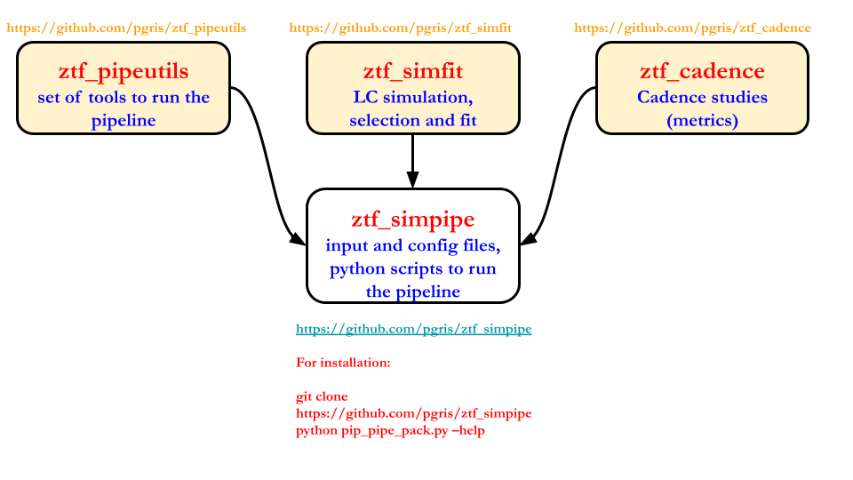

# ztf_simpipe

A framework to run ZTF simulations

```


```
## Release Status
|Release|Date|
|---|---|
|v1.0.0|20xx/xx/xx|


## Feedback, License etc

If you have comments, suggestions or questions, please [write us an issue](https://github.com/pgris/ztf_simpipe/issues).

This is open source software, available for re-use under the modified BSD license.

```
Copyright (c) 2022, the sn_pipe contributors on GitHub, https://github.com/pgris/ztf_simpipe/graphs/contributors.
All rights reserved.
```

## Overview of the pipeline



## Getting the package from github
```
 git clone https://github.com/pgris/ztf_simpipe (master)
or
git clone -b <tag_name> https://github.com/pgris/ztf_simpipe (release tag_name)
 ```
## Installation 

```
Installation of ztf_simpipe: python pip_pipe_pack.py --action install --package=ztf_simpipe
```

This pipeline is supposed to be modular, in the sense that only needed git packages are installed for
 a given task. The current tasks that may be run are:

| Task | package | command for installation|
|----|----|----|
| SN simulation | ztf_simfit | python pip_pipe_pack.py --action install --package=ztf_simfit |
| Cadence studies | ztf_cadence|python pip_sn_pack.py --action install --package=ztf_cadence |
|all | all | python pip_sn_pack.py --action install --package=all|
